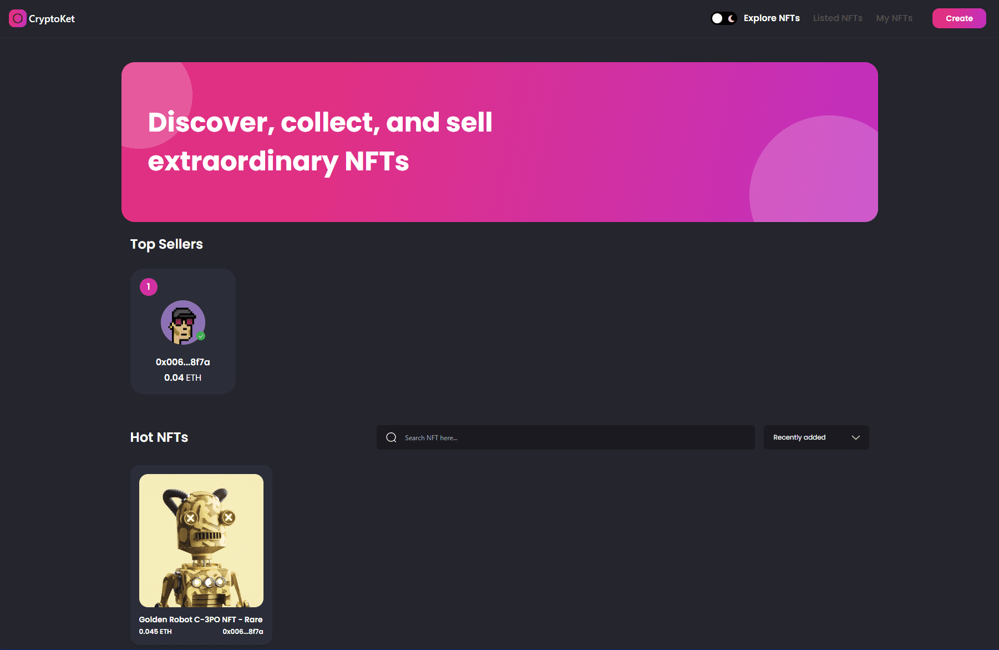

CryptoKet NFT Marketplace: Where Digital Assets Thrive
======================================================  

[Live Website](https://crypto-ket-nft-marketplace.vercel.app/)  

The CryptoKet NFT Marketplace is a dynamic platform designed to enable the seamless trading of Non-Fungible Tokens (NFTs). Built with Next.js and styled with Tailwind CSS, it offers a modern and user-friendly interface for NFT enthusiasts.

## Key Features:

* *Web3 Integration*: NFT Marketplace embraces Web3 concepts and technologies, ensuring a decentralized and secure trading environment.  

* *Smart Contract Development*: Leveraging Solidity, it facilitates the creation of smart contracts, enabling the creation and transfer of NFTs.  

* *IPFS Integration*: NFT assets are securely stored and accessed through the InterPlanetary File System (IPFS), ensuring data integrity and availability.  

The NFT Marketplace empowers artists, creators, and collectors to engage in the exciting world of digital asset trading. Whether you're minting your own NFTs or exploring unique digital collectibles, this platform provides the tools and infrastructure for a vibrant NFT ecosystem. Explore, create, and trade in the NFT Marketplace to unlock the potential of digital ownership and expression.  

